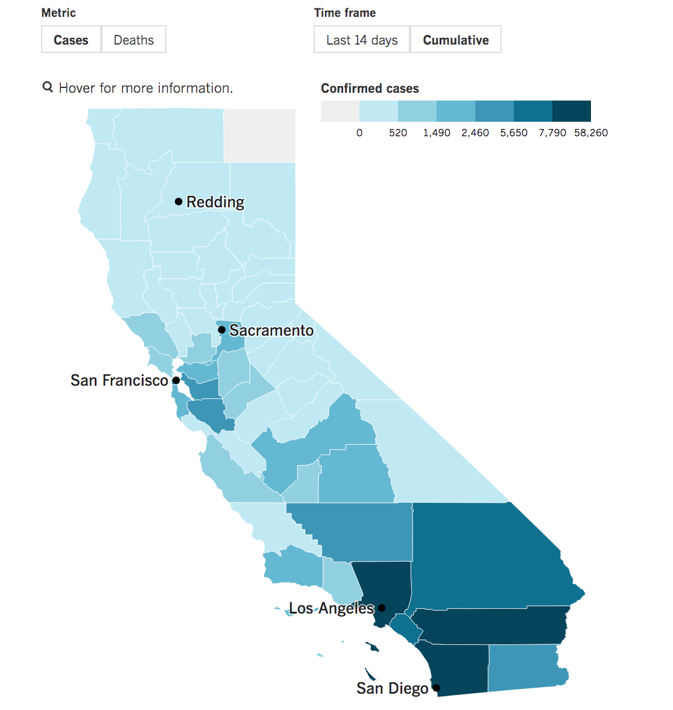
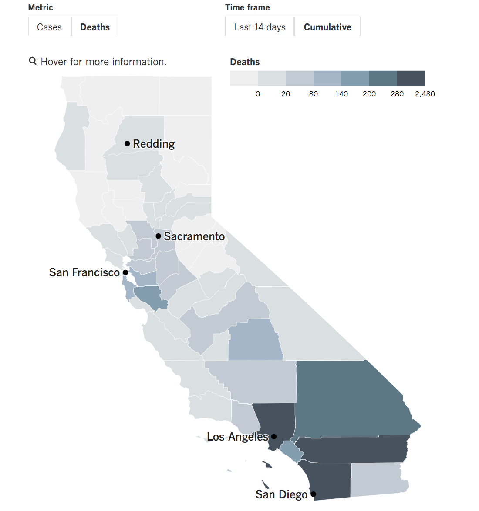

```{r setup, include=FALSE}
knitr::opts_chunk$set(echo = TRUE)
```


In recent months, the coronavirus pandemic has received widepsread coverage. Institutions and organizations like [JHU](https://coronavirus.jhu.edu/map.html), [CDC](https://www.cdc.gov/coronavirus/2019-ncov/cases-updates/cases-in-us.html), and [NY Times](https://www.nytimes.com/interactive/2020/world/coronavirus-maps.html) have created visualizations in an effort to provide information to the public about the global outbreak. 

However, nothing comes without criticism, no matter how well-intentioned. In his recent Washington Post [article](https://www.washingtonpost.com/politics/2020/03/11/be-careful-what-youre-learning-those-coronavirus-maps/), Brown University Professor Jordan Branch warns about the complications in mapping coronavirus. From potential political biases by using certain colors to implicit and explicit emphasis on certain information by data selection, maps present information but also argument. What is the map -- or rather, the creator of the map-- trying to say?  

Thus, the accuracy of scientific information is more important now than ever before. Understanding where the data is from, how to present the data, and asking many rigourous questions along the way are some of the fundamental steps in contributing to accurate representation. 

To satiate my own curiosity, I have been thinking a lot about the coronavirus reports, dashboards, and datasets. As a data scientist, I am unfortunately more nitpicky and careful when I look at a map (you'd be surprised how many mis-informed maps there are out there!). I care about labels, axes, variabilities, distributions, and even color more so than I would like to admit. Why the author placed the legend in the right corner instead of the left can be simply stylistic, but using an adjusted y-scale is intentional and it can change the overall shape of the plot. 

When I came across [LA Time's](https://www.latimes.com/projects/california-coronavirus-cases-tracking-outbreak/) COVID-19 Tracking Project, I knew I wanted to recreate the California map to make sense of it for myself. As a California native, it is devastating to see the confirmed case numbers increase on a daily basis. It is even more heart-breaking to come across the number of deaths as the state starts to gradually reopen.

<br />


Here are the two map that we will recreate: 
<br />


{#id .class width=50% height=50%}


<br />


<br />

{#id .class width=50% height=50%}


To recreate the maps, as seen above, we are going to utilize the MazamaSpatialUtils package. 

```{r}
library(MazamaSpatialUtils)
setSpatialDataDir("~/Data/Spatial")

library(sp)
library(tmap)
library(tidyverse)
library(rgdal)
library(stringr)

# Loading the datasets 
#convertUSCensusCounties()
#convertUSCensusStates()

loadSpatialData("USCensusCounties")
loadSpatialData("USCensusStates")
```


Where are we getting our data? Talk more about the 
```{r}
head(USCensusStates@data)
```


The U.S. state of California received its first confirmed case on January 26, 2020. As of May 30, 2020, California is nearing 60,000 confirmed cases and 2,500 deaths.
A scientist-first approach is paramount, and at Mazama Science, one of our core aphorisms is that science should be open, transparent, and reproducible. 


